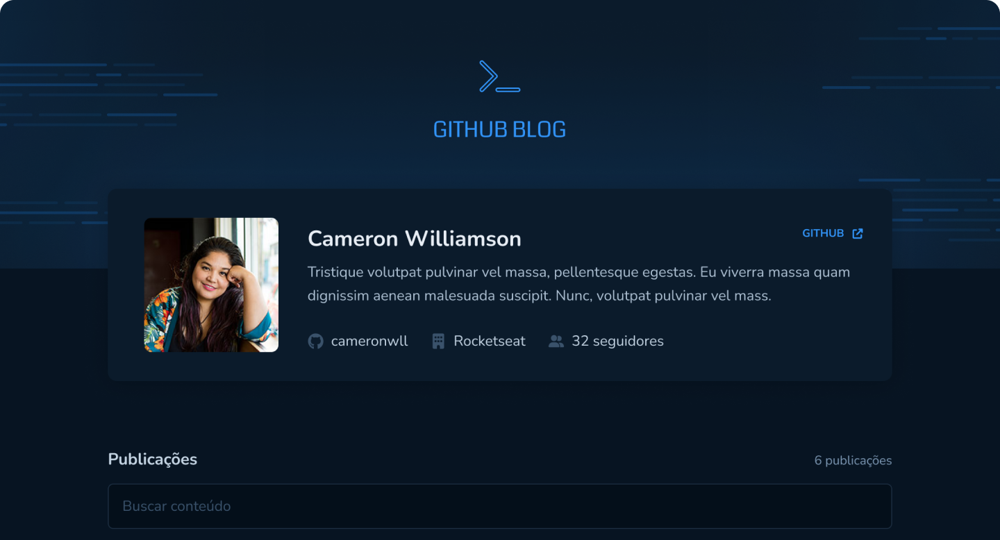

# Git Hub Blog



## Sobre

O GitHub Blog é um blog de issues do github ,o usuário adiciona seu perfil e o app busca todas issues do perfil do usuário, esse é um projeto simples que foi construído para treinar conceitos do React como fetch de dados e integração com back end.

## Instalação

```bash
git clone https://github.com/manoguii/github-blog.git
```

- Para rodar o projeto localmente
  1. Instale as dependências ```npm install```
  2. Execute a aplicação. ```npm run dev```
  3. Acesse `http://localhost:3000`

## Tecnologias

Algumas tecnologias utilizadas para construção da aplicação.

- [ReactJS](https://reactjs.org/)
- [TypeScript](https://www.typescriptlang.org/)
- [Styled Components](https://styled-components.com/)
- [React Hook Form](https://www.react-hook-form.com/)
- [Zod](https://zod.dev/)
- [GitHub API](https://docs.github.com/en/rest?apiVersion=2022-11-28)

---

<center>Made with 💙 by Guilherme David</center>
